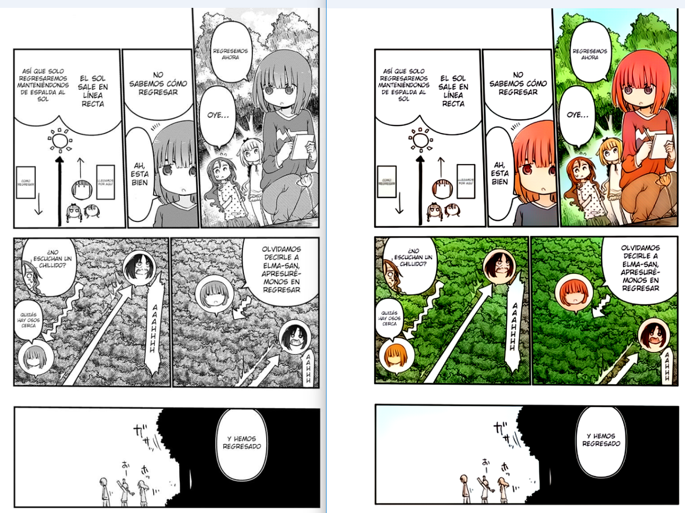

# Manga PDF Colorizator 🎨

An advanced AI-powered tool for colorizing black and white manga PDFs while preserving existing colored pages and text quality.

## 🌟 Features

- **Smart Colorization**: Automatically detects and preserves existing colored pages
- **Text Preservation**: Enhanced text clarity and sharpness in speech bubbles
- **Border Optimization**: Automatic white border removal for cleaner output
- **AI Upscaling**: Optional RealESRGAN upscaling for higher quality
- **GPU Acceleration**: CUDA support for faster processing

## 📋 Requirements

### System Requirements
- Python 3.7+
- CUDA-capable GPU (optional, for GPU acceleration)
- 8GB RAM minimum (16GB recommended)
- 2GB free disk space

### Dependencies
```bash
# Core dependencies
PyMuPDF==1.21.1
numpy>=1.21.0
Pillow>=9.0.0
opencv-python>=4.5.0
torch>=1.9.0
colorama>=0.4.4
basicsr>=1.4.2  # For RealESRGAN
```

## 🚀 Installation

1. Clone the repository:
```bash
git clone https://github.com/ahorasoft/manga-colorizator.git
cd manga-colorizator
```

2. Create a virtual environment:
```bash
python -m venv venv
source venv/bin/activate  # Linux/Mac
venv\Scripts\activate     # Windows
```

3. Install dependencies:
```bash
pip install -r requirements.txt
```

4. Download required models:
```bash
# Create directories
mkdir -p networks denoising/models

# Download colorization model
wget https://github.com/ahorasoft/manga-colorizator/releases/download/v1.0/generator.zip -O networks/generator.zip

# Download denoising models
wget https://github.com/ahorasoft/manga-colorizator/releases/download/v1.0/denoising_models.zip
unzip denoising_models.zip -d denoising/models/

# Download RealESRGAN model (optional, for upscaling)
wget https://github.com/xinntao/Real-ESRGAN/releases/download/v0.1.0/RealESRGAN_x4plus_anime_6B.pth -P upscaling/
```

## 💻 Usage Examples

### Command Line Usage
```bash
# Basic usage
python inference_pdf.py "manga.pdf"

# Advanced usage with all options
python inference_pdf.py \
    -sp 1 -ep 140 \        # Start page 1, end page 140
    -z 1.5 \               # Zoom factor 1.5x
    -ai \                  # Enable AI upscaling
    -pt 0 \               # Disable text preservation
    -ci 1 \               # Normal color intensity
    -cf 1.2 \             # Increased contrast
    -sf 1.0 \             # Normal sharpness
    "path/to/manga.pdf"

# Real example with enhanced contrast and sharpness
python inference_pdf.py -sp 14 -ep 17 -z 1.5 -ai -pt 0 -ci 1 -cf 1.5 -sf 1.2 "manga/chapter.pdf"

# Process specific chapter with GPU
python inference_pdf.py \
    -sp 45 -ep 65 \       # Process pages 45-65 only
    -g \                  # Enable GPU
    -s 768 \              # Higher resolution
    -ds 25 \              # Denoising strength
    "manga/chapter5.pdf"
```

### 📸 Example Results


*Left: Original black & white manga page. Right: AI-colorized result with enhanced contrast (cf=1.5) and sharpness (sf=1.2)*

Command used for this example:
```bash
python inference_pdf.py -sp 14 -ep 17 -z 1.5 -ai -pt 0 -ci 1 -cf 1.5 -sf 1.2 "manga/chapter.pdf"
```

Key settings:
- AI upscaling enabled (-ai)
- No text preservation (-pt 0) for artistic consistency
- Normal color intensity (-ci 1)
- Enhanced contrast (-cf 1.5)
- Subtle sharpness increase (-sf 1.2)

## 🛠️ Configuration Options

| Option | Default | Description |
|--------|---------|-------------|
| `-o, --output` | `input_colorized.pdf` | Output PDF path |
| `-g, --gpu` | `False` | Enable GPU acceleration |
| `-s, --size` | `576` | Processing size (must be multiple of 32) |
| `-nd, --no_denoise` | `False` | Disable denoising |
| `-ds, --denoiser_sigma` | `25` | Denoising strength (1-50) |
| `-z, --zoom` | `1.0` | Output zoom factor (0.1-4.0) |
| `-ai, --ai_upscale` | `False` | Enable RealESRGAN upscaling |
| `-pt, --preserve_text` | `0.5` | Text preservation strength (0.0-1.0) |
| `-ci, --color_intensity` | `1.0` | Color intensity (0.5-2.0) |
| `-cf, --contrast_factor` | `1.2` | Contrast enhancement (0.5-2.0) |
| `-sf, --sharpness_factor` | `1.0` | Sharpness enhancement (0.0-2.0) |

## 📁 Project Structure
```
manga-colorizator/
├── networks/
│   └── generator.zip          # Colorization model
├── denoising/
│   └── models/               # Denoising models
├── upscaling/
│   └── RealESRGAN_x4plus_anime_6B.pth  # Upscaling model
├── inference.py              # Single image colorization
├── inference_pdf.py          # PDF processing
└── colorize.py              # CLI interface
```

## 🔍 Troubleshooting

### Common Issues

1. **Model Loading Errors**
   ```
   Error: Could not find generator.zip
   Solution: Ensure all models are downloaded to correct directories
   ```

2. **CUDA Out of Memory**
   ```python
   # Reduce processing size
   colorizer = PDFColorizer(
       use_gpu=True,
       size=384  # Default is 576
   )
   ```

3. **Blurry Text**
   ```python
   # Increase text preservation
   colorizer = PDFColorizer(
       preserve_text=0.8,
       denoiser_sigma=15
   )
   ```

4. **Over-processed Images**
   ```python
   # Reduce enhancement factors
   colorizer = PDFColorizer(
       contrast_factor=1.1,    # Subtle contrast increase
       sharpness_factor=1.0,   # No sharpness change
       color_intensity=1.0     # Normal colors
   )
   ```

## 📧 Contact

- Website: http://www.ahorasoft.com
- Email: support@ahorasoft.com
- Issues: [GitHub Issues](https://github.com/ahorasoft/manga-colorizator/issues)

---
Made with ❤️ by Ahorasoft